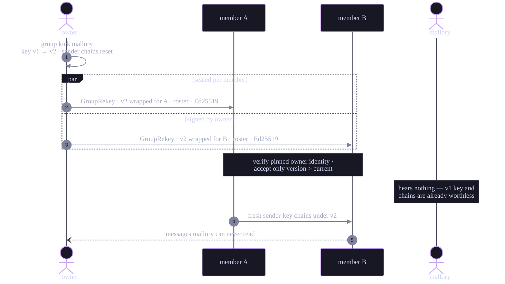

# Susurri

> *Most people don't appreciate anonymity before they lose it, and you only get to lose it once.*

Decentralized, anonymous peer-to-peer messenger. Peers find each other through a Kademlia DHT and talk over Tor-style onion routes — no servers, no accounts, no phone numbers. One self-contained binary acts as the interactive client, a headless bootstrap seed, or both.

**Status: experimental, unaudited.** Known gaps are tracked honestly in [KNOWN-LIMITATIONS.md](KNOWN-LIMITATIONS.md).

## Quick start

```bash
dotnet publish src/Bootstrapper/Susurri.CLI/Susurri.CLI.csproj \
  -c Release -r linux-x64 --self-contained -o ./dist

./dist/susurri-cli --bootstrap -p 7070          # headless seed at a known address

DHT__BootstrapNodes__0=1.2.3.4:7070 ./dist/susurri-cli
# > generate          create a BIP39 passphrase — this is your identity
# > login alice       derive keys from the passphrase, join the network
# > send bob hi       DHT lookup + onion-routed delivery
# > inbox             received messages
```

Full walkthrough (multi-node setup, groups, health endpoint): [RUN.md](RUN.md).

## How it works

The life of one message — every box on the sender's side is a separate cryptographic layer, every hop knows as little as possible:

```mermaid
%%{init: {'theme':'base','themeVariables':{'primaryColor':'#313244','primaryTextColor':'#cdd6f4','primaryBorderColor':'#45475a','lineColor':'#7f849c','textColor':'#cdd6f4','titleColor':'#cdd6f4','clusterBkg':'#1e1e2e','clusterBorder':'#313244','edgeLabelBackground':'#1e1e2e','fontFamily':'ui-monospace, SFMono-Regular, Menlo, monospace','fontSize':'13px'}}}%%
flowchart LR
    classDef crypto fill:#181825,stroke:#cba6f7,color:#cba6f7,stroke-width:1.5px
    classDef net fill:#181825,stroke:#89b4fa,color:#89b4fa,stroke-width:1.5px
    classDef store fill:#181825,stroke:#f9e2af,color:#f9e2af,stroke-width:1.5px
    classDef endpoint fill:#181825,stroke:#a6e3a1,color:#a6e3a1,stroke-width:1.5px
    classDef warn fill:#181825,stroke:#fab387,color:#fab387,stroke-width:1.5px

    subgraph alice["alice · sender"]
        direction TB
        MSG["✉️ plaintext"] --> FS["🔐 forward secrecy<br/>DM → double ratchet<br/>group → sender-key chain"]
        FS --> PAD["⬛ pad to fixed 16 KB<br/>size & entropy leak nothing"]
        PAD --> SEAL["🧅 seal 3 onion layers<br/>X25519 → HKDF → ChaCha20-Poly1305"]
    end

    SEAL -->|"sees alice,<br/>not bob"| R1
    subgraph route["onion route · 3 random relays"]
        direction LR
        R1["relay 1"] -->|"peels its layer"| R2["relay 2"]
        R2 -->|"peels its layer"| R3["relay 3"]
    end
    R3 -->|"sees bob,<br/>not alice"| ON{"bob<br/>online?"}

    ON -->|yes| BOB["📬 bob<br/>unseal → ratchet → read"]
    ON -->|no| OFF[("DHT offline store<br/>signed pickup · ≤ 8 days")]
    OFF -.->|"next login"| BOB
    BOB --> ACK["🧾 ACKs & replies ride encrypted<br/>reply tokens back through the chain —<br/>bob never learns alice's address"]

    class MSG,BOB,ACK endpoint
    class FS,PAD,SEAL crypto
    class R1,R2,R3 net
    class OFF store
    class ON warn
```



### Identity

There is no registration. An identity is derived deterministically from a BIP39 passphrase:

```
passphrase + salt ── PBKDF2-SHA256 (600k iter) ──▶ 64-byte seed
                                                    ├─▶ Ed25519 signing key
                                                    └─▶ X25519 encryption key
```

The `username → public key` mapping is published as a signed record in the DHT; whoever holds the passphrase *is* that user, on any machine.

### Peer discovery — Kademlia DHT

Full Kademlia implementation: 256-bit node IDs (SHA-256 of the public key), XOR distance, 20-node k-buckets with LRU eviction, iterative lookups with α=3 parallelism. Besides key directory records, the DHT stores **offline messages**: encrypted blobs a recipient can only retrieve with an Ed25519-signed request carrying a timestamp (±5 min replay window), so nodes can't harvest another user's queue.

### Onion routing

Every message travels through 3 randomly selected relays. Each layer is independently sealed: ephemeral X25519 → ECDH → HKDF-SHA256 with a domain-separated context string → ChaCha20-Poly1305. A relay learns only the previous and next hop; the recipient learns the sender from the innermost plaintext, never from the network. Encrypted **reply tokens** ride along with each message, letting the recipient send ACKs and replies back through the chain without ever learning the sender's address. All payloads are padded to fixed 16 KB blocks with random bytes, so ciphertext size and compressibility leak nothing.

### Forward secrecy — double ratchet

Direct messages run through a Signal-style double ratchet per peer: message keys come off a one-way HMAC-SHA256 symmetric chain, and a periodic X25519 DH ratchet rekeys the root chain. Compromising a current key exposes neither past traffic (forward secrecy) nor future traffic once the DH ratchet turns (post-compromise security). Out-of-order delivery is handled by retaining a bounded window of skipped message keys. This sits *on top of* the per-message ephemerals at the onion layer.

### NAT traversal

Three escalating strategies: STUN-based public endpoint discovery with NAT type detection, DHT-coordinated UDP hole punching, and — when both peers sit behind symmetric NAT and hole punching cannot work — fallback relaying through a third node. The relay only ever forwards onion ciphertext; it cannot read what it carries.

### Group chat

A group has a symmetric key wrapped individually for every member with their X25519 key; it proves membership and seals invites. Message content adds forward secrecy on top: each sender runs a one-way HKDF hash chain (Signal-style sender keys), so every message uses a fresh key derived from both the sender's chain and the group key, and consumed chain state is erased. The chain seed travels sealed to each member's X25519 key, piggybacked on the first message (and periodically re-attached, so a member who missed it recovers). Sender chains also re-key themselves on an epoch (every 256 messages or 24 h) with a fresh random seed, bounding what a stolen chain state can decrypt going forward. Messages use the same padded onion transport as direct messages, so group traffic is indistinguishable on the wire.

Re-keying is automatic and in-band: `group rotate` (and `group kick`, which removes a member first) issues a new group key and delivers it to every remaining member as an owner-signed, individually sealed onion message — no out-of-band codes, offline members pick it up on next login. Members verify the rotation against the owner identity pinned at join time, versions are monotonic (no rollback), and each re-key carries the current member roster so every member can fan out to the whole group. A kicked member never receives the new key: their chains and group key go stale immediately.



### Contact book — petnames and key pinning

`contacts add <petname> <user>` pins a contact's keys locally under a name you choose. Pinned keys are used directly for sending — a poisoned DHT record can no longer redirect your messages — and incoming traffic from a pinned key shows the petname. `contacts verify` renders a Signal-style 60-digit safety number (both sides see the same number) for out-of-band verification; `contacts check` compares the pin against the live DHT record to detect substitution attempts. The book is stored encrypted, per identity.

### Local history — encrypted, opt-in

By default everything lives in RAM and a restart forgets it. `history on` persists conversations to disk, encrypted with a key derived from your passphrase seed (AES-256-GCM; the key never touches disk). `history off` shreds the store. Group ratchet state and group keys are persisted the same way, so forward secrecy survives restarts instead of resetting.

## Cryptography

| Purpose | Primitive |
|---|---|
| Key agreement | X25519 |
| AEAD | ChaCha20-Poly1305 |
| Signatures | Ed25519 |
| KDF | HKDF-SHA256 (domain-separated), PBKDF2-SHA256 (600k) |
| Keys at rest | AES-256-GCM, passphrase-derived |
| Local stores (history, contacts, groups, ratchet state) | AES-256-GCM under HKDF subkeys of the identity seed |

All primitives via [NSec](https://nsec.rocks/) (libsodium). Constant-time comparisons, CSPRNG-only randomness, key material zeroed after use.

## Repository layout

```
src/Bootstrapper/Susurri.CLI/     cross-platform CLI + bootstrap seed mode
src/Bootstrapper/Susurri.Bootstrapper/  WPF demo (Windows only)
src/Modules/DHT/                  Kademlia, onion routing, ratchet, NAT traversal, groups
src/Modules/IAM/                  key derivation, encrypted key storage
src/Modules/Users/                user persistence (EF Core + PostgreSQL)
tests/                            xUnit test suites
deploy/                           bootstrap node: systemd unit + VPS scripts
installers/                       Arch PKGBUILD, Windows installer
```

On Linux build the CLI project directly — the WPF project targets `net10.0-windows` and won't compile:

```bash
dotnet build src/Bootstrapper/Susurri.CLI/Susurri.CLI.csproj -c Release
dotnet test
```

Requires the .NET 10 SDK. CI enforces warnings-as-errors, a per-assembly coverage gate, dependency pinning with lockfiles, and fuzz + security scan workflows.

## Running a bootstrap node

The network needs at least one seed at a known address — an ordinary DHT node that sees no message content. `deploy/` contains a hardened systemd unit, a one-time VPS setup script, and a GitHub Actions workflow (`deploy-bootstrap`) that publishes and ships a release to the seed on every green build of `main`, with health-checked activation and automatic rollback.

## Threat model, honestly

- No cover traffic yet — a global passive adversary can attempt timing correlation.
- The DHT has no Sybil resistance beyond signed records.
- Bootstrap seeds are a trust-on-first-use entry point; run several.

Details and remediation phases: [KNOWN-LIMITATIONS.md](KNOWN-LIMITATIONS.md).

## License

MIT — see [LICENSE](LICENSE).
